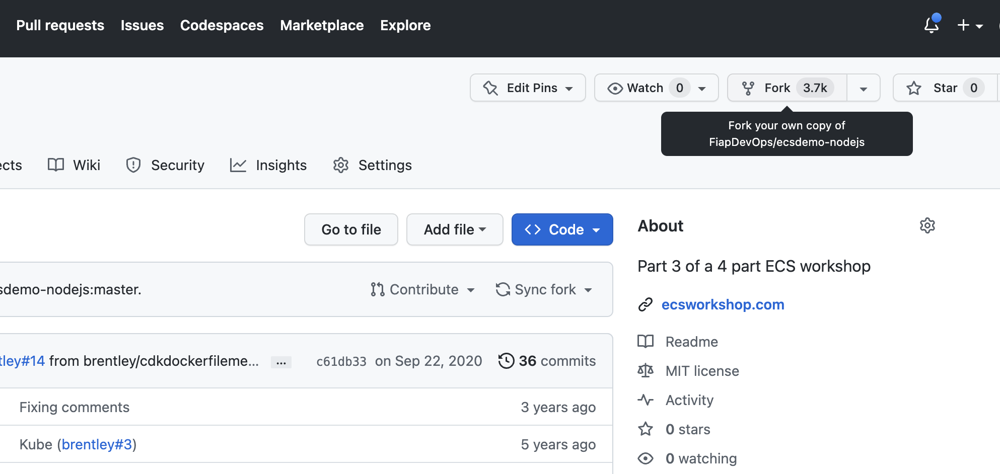
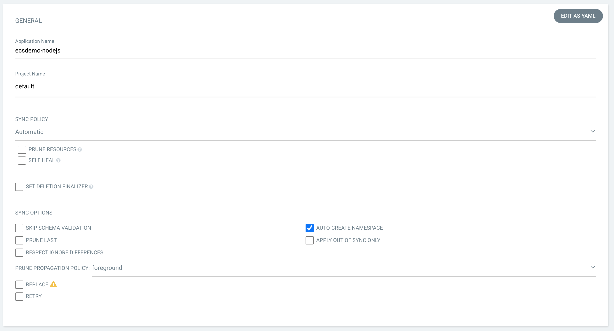
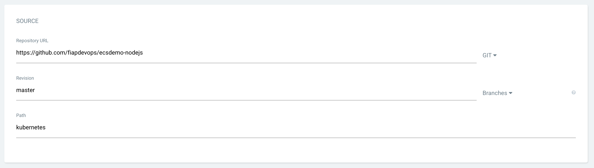
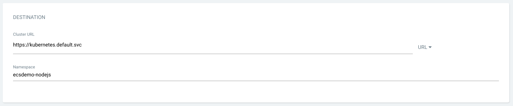
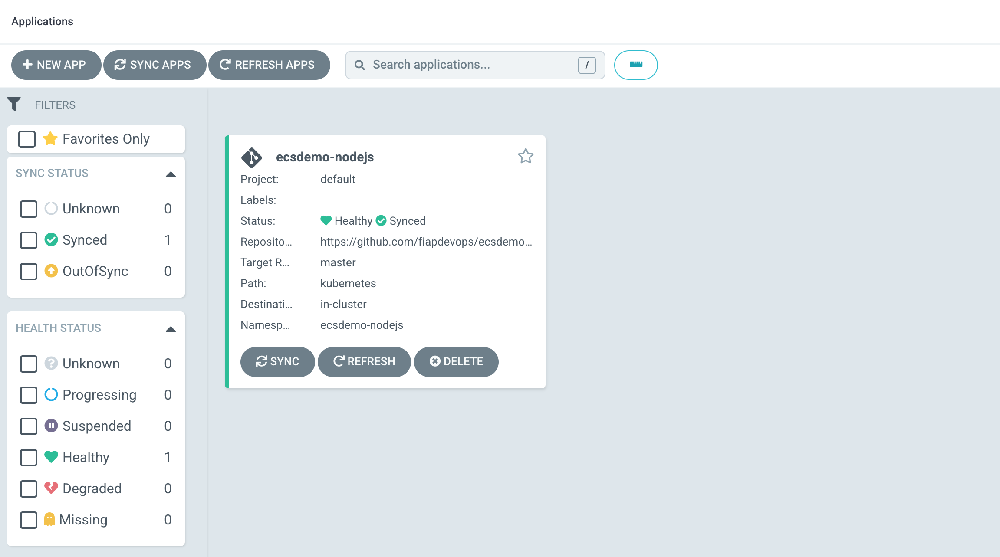
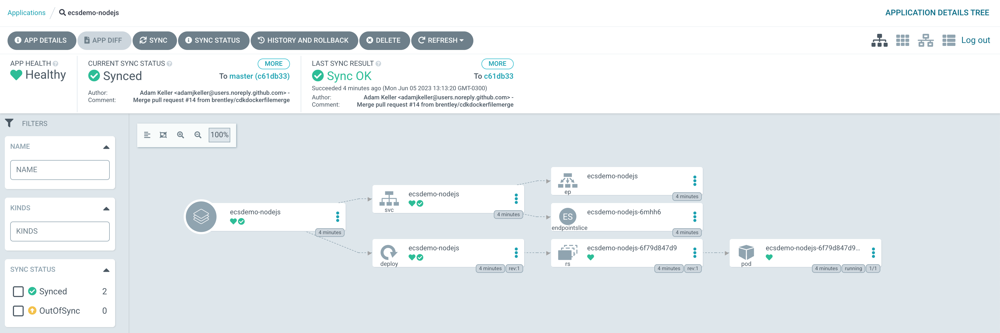
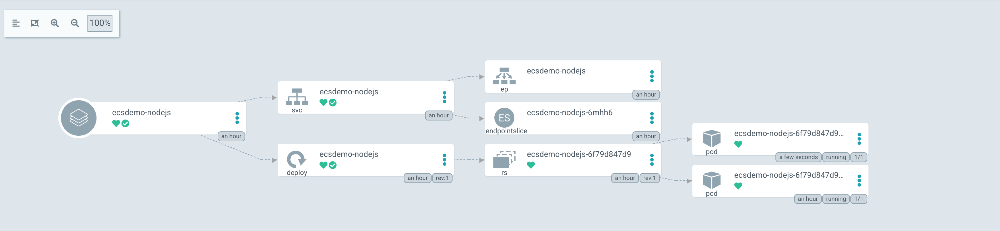

# Instalação do Argo CD

Antes de entregarmos nossa aplicação via Argo será preciso que você obtenha uma cópia do repositório em sua conta no github, para isso, acesse a URL a seguir e faça um fork do projeto:

[https://github.com/fiapdevops/ecsdemo-nodejs.git](https://github.com/fiapdevops/ecsdemo-nodejs.git)

!SLIDE transition=scrollUp

# Instalação do Argo CD

- Com a cópia efetuada acesse a interface do ArgoCD, clique na opção **+ NEW APP** no canto superior esquerdo da tela;

Preencha os campos da sessão GENERAL conforme abaixo:

!SLIDE transition=scrollUp

# Instalação do Argo CD

Preencha os campos da sessão SOURCE conforme abaixo usando a URL da sua cópia do Repositório:

Preencha os campos da sessão DESTINATION conforme abaixo:

!SLIDE transition=scrollUp

# Instalação do Argo CD

- Ao final do processo clique na botão **CREATE** no topo da tela e acompanhe o status:

!SLIDE transition=scrollUp

# Instalação do Argo CD

- Em alguns instântes a App estará entregue, visualze a relação entre os componentes e a estrutura criada clicando sobre a App:

.callout.question `É possível automatizar essa etapa? Sim, A mesma estrutura poderia ser entregue usando o componente de linha de comando ARGOCLI ou usando o Custom Resource criado no Kubernetes, verifique a documentação nas referências`

!SLIDE transition=scrollUp

# Instalação do Argo CD

- Para avalidar o fluxo altere a estrutura do deployment no repositório git ajustando o número de réplicas do componente deployment.yaml na pasta kubernetes e efetuando o commit da mudança;

- Em seguida clique na opção **SYNC** para forçar o CD a verificar o repositório, ou aguarde até que o processo ocorra automaticamente;

- Verifique a mudança na interface do Argo:

