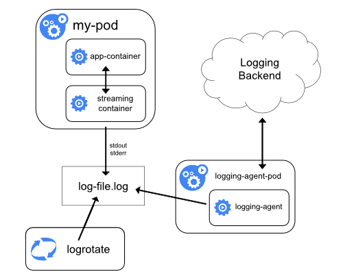

!SLIDE transition=scrollUp

# Rodando multiplos containers

Um Pod é compostosto por um ou mais containers

- O uso de multiplos containers faz sentido em contextos em que a aplicação é composta e demanda mais de uma ativdade ou seja, mais de um processo principal;

- Outra possibilidade é para a existência de um container auxiliar para atuar suporte a um Container principal, chamamos esse container de sidecar;

!SLIDE transition=scrollUp

# Rodando multiplos containers

Usando um exemplo prático poderiamos configurar um container sidecar especializado em envio de logs; 

Esse container seria projetado como um agente de criação de log, configurado para coletar logs de um container da aplicação e enviar para um sistema que garanta a retenção;

!SLIDE transition=scrollUp

# Init Containers

De forma similar containers podem ser usados para inicialização ou preparação de workloads, esse tipo de container é executado antes dos containers da aplicação/pod. 

Os containers de inicialização podem conter utilitários ou scripts de configuração não presentes em uma imagem da aplicação/pod que será executada a seguir.

!SLIDE transition=scrollUp

# Init Containers

No [exemplo abaixo](https://raw.githubusercontent.com/kubernetes/website/main/content/en/examples/pods/init-containers.yaml) um container de inicialização é criado com a função de executar o download do conteúdo que será exposto pelo container principal

    @@@shell
    initContainers:
    - name: install
        image: busybox:1.28
        command:
        - wget
        - "-O"
        - "/work-dir/index.html"
        - http://info.cern.ch          
        volumeMounts:
        - name: workdir
          mountPath: "/work-dir"

!SLIDE transition=scrollUp

# Init Containers

Para executar o exemplo aplique o resource abaixo:

    $ kubectl apply -f <URL>

URL que será usada no comando:

[Copie a URL aqui](https://raw.githubusercontent.com/kubernetes/website/main/content/en/examples/pods/init-containers.yaml)