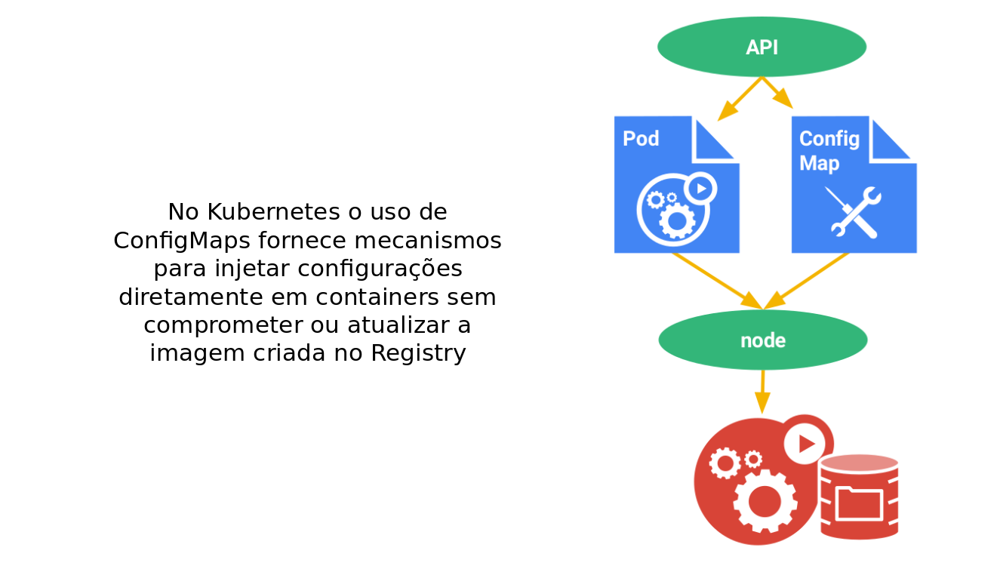

!SLIDE center transition=scrollUp

# Configmaps

!SLIDE transition=scrollUp

# Configmaps

- Algumas aplicações podem requerer configurações aplicaveis através de arquivos de configuração, argumentos passados via linha de comando e [variáveis de ambiente](https://kubernetes.io/docs/tasks/configure-pod-container/define-environment-variable-container/), 

- Tais configurações devem ser desacopladas do conteúdo da imagem, a fim de manter os containers portateis e de fácil manipulação, assim uma alteração de parâmetros não implicaria na criação de uma nova release de imagem do container. 

- Esse modelo de configuração pode ser obtido utilizando [ConfigMaps](https://kubernetes.io/docs/tasks/configure-pod-container/configmap/)

!SLIDE transition=scrollUp

# Configmaps

!SLIDE transition=scrollUp

# Configmaps

O ConfigMaps pode ser usado para:

- Preencher os valores das variáveis de ambiente;
- Definir argumentos de linha de comando;
- Preencher arquivos de configuração em um volume;

.callout.info `O ConfigMap atua utilizando campos do tipo chave=valor, estes campos contém dados de configuração que podem ser consumidos por pods ou usados para armazenar o conteudo de arquivos de configuração para componentes do sistema.`

!SLIDE transition=scrollUp

# Configmaps

Para testar o uso do recurso configmap usaremos um arquivo com uma regra de proxy, o arquivo frontend.conf

Esse arquivo será aplicado como configuração nos containers de Nginx das pods de Frontend;

    @@@shell
    upstream backend {
    server backend;
    }

    server {
        listen 80;

        location / {
            proxy_pass http://backend;
        }
    } 

.download frontend.conf

!SLIDE commandline incremental transition=scrollUp

# Configmaps

Para facilitar a execução do workshop faça uma cópia do projeto com as estruturas de yaml:

	$ git clone https://github.com/fiapdevops/kube-class

Acesse o diretório com as estruturas:

	$ cd kube-class/workshop/_files/share

Use o arquivo [configmap.yaml](https://raw.githubusercontent.com/fiapdevops/kube-class/main/workshop/_files/share/configmap.yaml) para criação de um ConfigMap:

	$ kubectl -n demo create -f configmap.yaml
	configmap/frontend-config created

URL usada no comando: https://raw.githubusercontent.com/fiapdevops/kube-class/main/workshop/_files/share/configmap.yaml

!SLIDE commandline incremental transition=scrollUp

# Configmaps

O yaml utilizado para criar o arquivo de configuração como um Configmap pode ser obtido [nesta url](https://raw.githubusercontent.com/fiapdevops/kube-class/main/workshop/_files/share/configmap.yaml);

	$ kubectl get configmap -n demo
	NAME               DATA     AGE
	frontend-config    1      	40s
	kube-root-ca.crt   1      	3h37m

.callout.info `Também é possivel criar um configmap diretamente a partir do arquivo de configuração via linha de comando, neste caso a sintaxe seria a seguinte: "kubectl create configmap frontend-config --from-file=frontend.conf"`

!SLIDE commandline incremental transition=scrollUp

# Configmaps

Na execução anterior criamos um configmap com uma chave chamada "frontend-config" essa chave armazena o arquivo de configuração "frontend.conf";

	$ kubectl describe configmaps frontend-config -n demo

	Name:			frontend-config
	Namespace:		XXX
	Labels:			<none>
	Annotations:	<none>

	Data
	====
	...

.callout.info `É possível criar um Configmap com várias chaves, sendo cada uma uma configuração diferente, isto é, arquivos de configuração distintos a serem entregues no container`