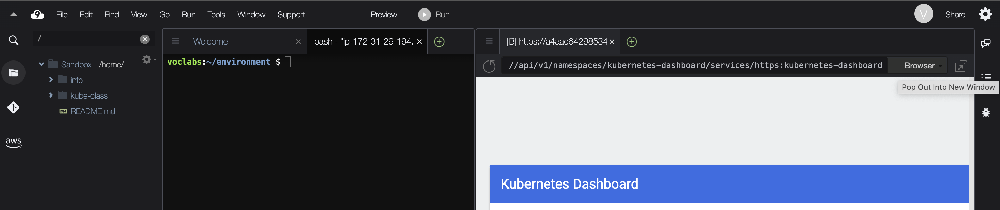

!SLIDE center transition=scrollUp

# Kubernetes Dashboard

!SLIDE transition=scrollUp

# Deploy do Kubernetes Dashboard

Nesta etapa criaremos uma ide simples para gerenciar workloads no kubernetes entregue em EKS:

!SLIDE commandline incremental transition=scrollUp

# Deploy do Kubernetes Dashboard

Crie uma variável e faça a entrega a partir do repositório remoto:

	$ export DASHBOARD_VERSION="v2.6.0"

	$ kubectl apply -f <URL>
	
URL que será usada no comando:

[Copie a URL aqui](https://raw.githubusercontent.com/kubernetes/dashboard/${DASHBOARD_VERSION}/aio/deploy/recommended.yaml)

.callout.question `O painel oficial do Kubernetes não é implantado por padrão, mas há instruções na documentação oficial, link da página de ref ao final da etapa`

!SLIDE transition=scrollUp

# Deploy do Kubernetes Dashboard

Em seu ambiente Cloud9, clique em: **Tools / Preview / Preview Running Application**

A partir da tela aberta na lateral ao final da URL adicione o seguinte endereço:

/api/v1/namespaces/kubernetes-dashboard/services/https:kubernetes-dashboard:/proxy/

Na tela de login na guia do navegador Cloud9 Preview, pressione o botão no canto superior esquerdo para abrir uma seção segregada:

.callout.warning `O navegador Previeew criado na IDE do Cloud9 não oferece suporte à autenticação de token,`

!SLIDE commandline incremental transition=scrollUp

# Deploy do Kubernetes Dashboard

Para acessar o dashboard utilize a cli eksctl para recuperar o token usado na autenticação:

	$ aws eks get-token --cluster-name eksworkshop | \
		jq -r '.status.token'

.callout.info `Copie e cole este token na tela do dashboard e clique em Sign in`