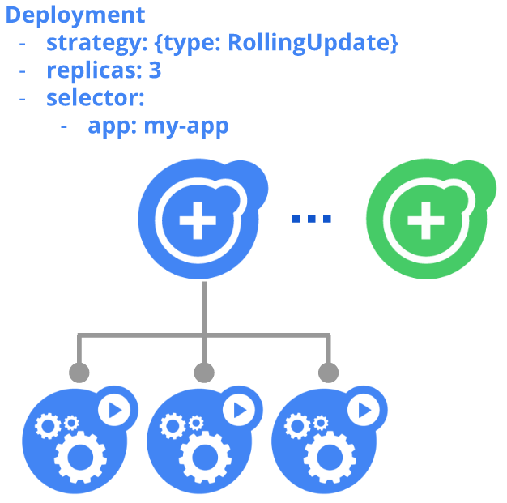

!SLIDE center transition=scrollUp

# Deployments

!SLIDE transition=scrollUp

# Deployments

!SLIDE transition=scrollUp

# Deployments

- [Deployments](https://kubernetes.io/docs/concepts/workloads/controllers/deployment/) são utilizados para definir a estrutura de Pods e Replicasets; 

- Dentro de um Deployment é declarado o estado esperado para um conjunto de objetos, por exemplo, podemos declarar que uma pod deverá possuir 3 replicas;

- Você pode utilizar Deployments para criar novos recursos ou substituir a configuração de recursos existentes;

!SLIDE transition=scrollUp

# Deployments

Crie o arquivo [fe-deployment.yaml](https://raw.githubusercontent.com/fiapdevops/kube-class/main/workshop/_files/share/fe-deployment.yaml) conforme modelo abaixo:

    @@@shell
    apiVersion: apps/v1
    kind: Deployment
    metadata:
      name: fe-deployment
    spec:
      selector:
    matchLabels:
          app: nginx
          tier: fe     
      replicas: 2 # tells deployment to run 2 pods matching the template
      template:
        metadata:
          labels:
            app: nginx
            tier: fe
        spec:
          containers:
          - name: nginx
            image: nginx:1.14.2
    	    ...

.download fe-deployment.yaml

!SLIDE commandline incremental transition=scrollUp

# Deployments

Execute o kubectl create:

	$ kubectl create -f fe-deployment.yaml -n demo
	deployment "fe-deployment" created

	$ kubectl get deployments -n demo
	NAME            READY   UP-TO-DATE   AVAILABLE   AGE
	fe-deployment   2/2     2            2           6s

- O retorno obtido acima indica que o deployment possui duas réplicas disponíveis ( Campos DESIRED e CURRENT );
- Ambas estão atualizadas ( Campo UP-TO-DATE );
- Ambas estão disponíveis para uso ( Campo AVAILABLE );

!SLIDE commandline incremental transition=scrollUp

# Deployments
	
Verifique a se as pods foram criadas via deployment:

	$ kubectl get pods -n demo
	NAME                     READY     STATUS    RESTARTS   AGE
	fe-deployment-599bb48c7-2fvmw   1/1     Running   0     51s
	fe-deployment-599bb48c7-zjwmw   1/1     Running   0     51s

!SLIDE commandline incremental transition=scrollUp

# Deployments

Remova a pod criada via deploy e verifique novamente a relação de pods 

	$ kubectl delete pod --all -n demo
	pod "fe-deployment-599bb48c7-2fvmw" deleted
	pod "fe-deployment-599bb48c7-zjwmw" deleted

	$ kubectl get pods -n demo
	NAME                            READY   STATUS    RESTARTS   AGE
	fe-deployment-599bb48c7-8shv4   1/1     Running   0          4s
	fe-deployment-599bb48c7-rjrph   1/1     Running   0          4s

.callout.info `O controlador de Deployment garantirá a existência de 2 replicas, adicionando uma nova replica para atingir o valor pretendido na configuração`

!SLIDE commandline incremental transition=scrollUp