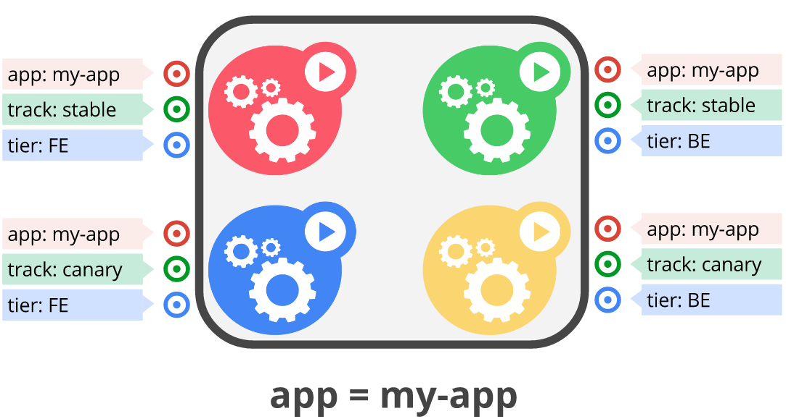
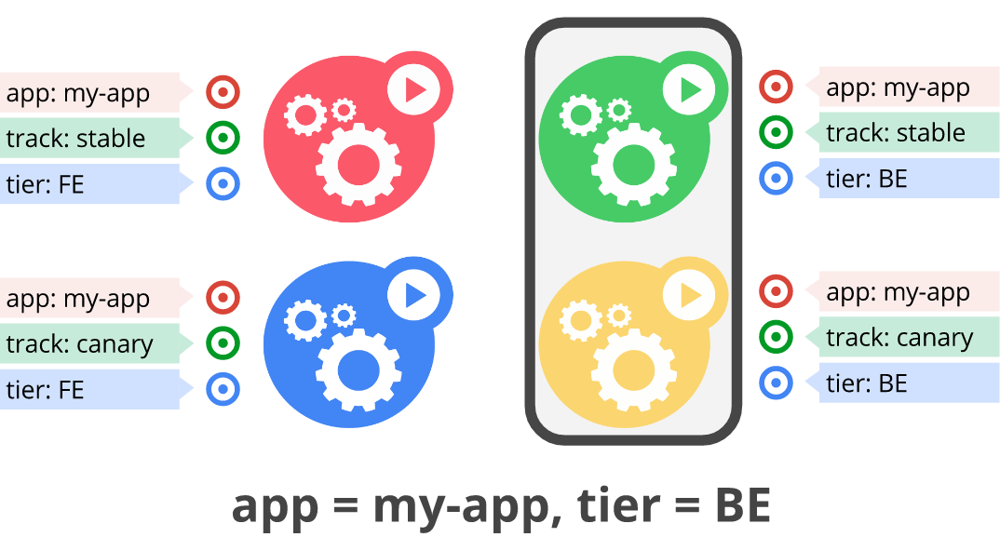
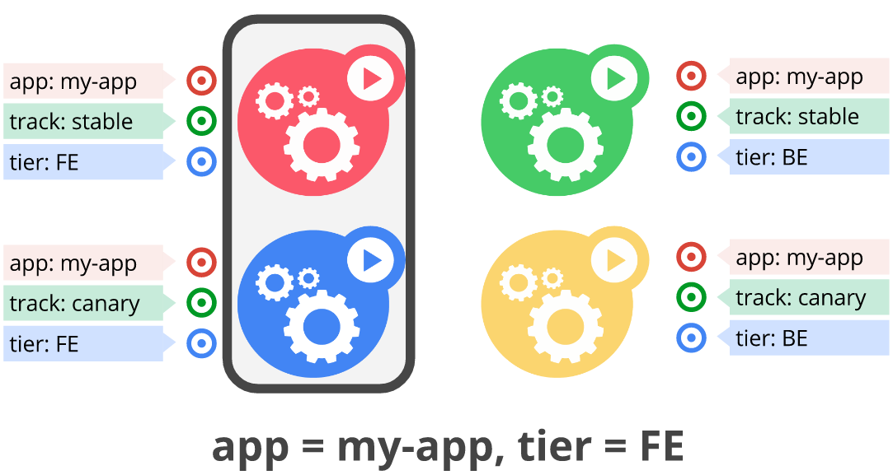

!SLIDE center transition=scrollUp

# O uso de Labels

!SLIDE transition=scrollUp

# O uso de Labels

Uma label é um atributo do tipo chave/valor, sua principal função é atuar como mecanismo para agrupamento de recursos;

!SLIDE commandline incremental transition=scrollUp

# O uso de Labels

É possível utilizar uma label para identificar e localizar as pods:

	$ kubectl get pods -l app=nginx -n demo
	NAME                            READY   STATUS    RESTARTS   AGE
	fe-deployment-599bb48c7-2kd56   1/1     Running   0          11m
	fe-deployment-599bb48c7-4h4gz   1/1     Running   0          26m
	...

.callout.info `No modelo entregue no exemplo anterior todas as pods criadas utilizam a label "app: nginx" e "tier: fe"`

.callout.warning `Cuidado com a execução de filtros, um filtro com mais de uma label somente trará resultado se AMBAS AS LABELS EXISTIREM em uma mesma POD`

!SLIDE transition=scrollUp

# O uso de Labels

Essas labels são usadas para segregar grupos de pods, por exemplo, um grupo de pods que atua como backend da aplicação poderia receber uma label "tier: BE":

!SLIDE transition=scrollUp

# O uso de Labels

Outro grupo de pods que atua como frontend e proxy reverso rodando nginx rereceberia uma label "tier: FE":

!SLIDE commandline incremental transition=scrollUp

# O uso de Labels

Com base nessas labels temos sub-grupos de pods que podem ser acessadas e referenciadas isoladamente:

	$ kubectl get pods -l app=nginx,tier=fe -n demo
	NAME                    READY     STATUS    RESTARTS   AGE
	hello-7858b7dddc-f92tr  1/1       Running   0          20m
 
	$ kubectl get pods -l k8s-app=kube-dns -n kube-system
	NAME                       READY   STATUS    RESTARTS       AGE
	coredns-5d78c9869d-5kbqd   1/1     Running   1 (168m ago)   38h
	coredns-5d78c9869d-kbhp7   1/1     Running   1 (168m ago)   38h

.callout.conversation `É muito comum e extremamente recomendável que existam labels para identificação de sub-grupos especificos de pod com base em sua função ou track de versão por exemplo, e que exista ao menos uma label capaz de identificar todas as pods que compoem um produto ou aplicação`