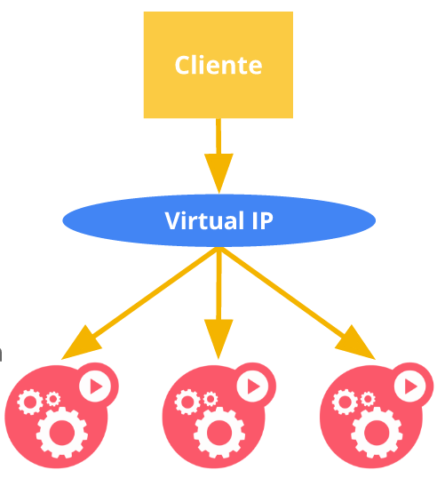

!SLIDE center transition=scrollUp

# Publicando Serviços

!SLIDE transition=scrollUp

# Publicando Serviços

No Kubernetes [Serviços](https://kubernetes.io/docs/concepts/services-networking/service/) são usados por clientes externos para acessar uma aplicação em execução no namespace.

    @@@shell
    apiVersion: v1
    kind: Service
    metadata:
      name: my-service
    spec:
      selector:
        app.kubernetes.io/name: MyApp
      ports:
        - protocol: TCP
          port: 80
          targetPort: 9376

!SLIDE commandline incremental transition=scrollUp

# Publicando Serviços

Crie um serviço usando o comando expose:

	$ kubectl expose deployment fe-deployment \
      --name=frontend --port=80 -n demo
	service/frontend exposed

	$ kubectl get services -n demo
	NAME       TYPE        CLUSTER-IP     EXTERNAL-IP   PORT(S)   AGE
	frontend   ClusterIP   10.97.143.80   <none>        80/TCP    40m

É possível obter a estrutura yaml ou json completa com o parametro --output:

	$ kubectl get svc -n demo -o yaml 

!SLIDE transition=scrollUp

# Publicando Serviços

***Endpoints e Selectors***

- Para que um serviço consiga referenciar um determinado conjunto de PODS ele criará um ***endpoint***

- Um endpoint baseia-se em labels para definir qual POD e quais containers atuarão como backend para serviços;

- Chamamos essa relação de labels de ***seletores***;

- Um seletor é usado para  apontar dentro de um serviço qual a label dos containers que serão acessados;

- A partir da relação de labels passadas no campo "selector" o kubernetes determina e cria automaticamente seus endpoints;

!SLIDE transition=scrollUp

# Publicando Serviços

O seletor utilizado na criação do serviço aponta para as pods que atuaram como endpoints:

    @@@shell
        ...
      selector:
        app: nginx
        tier: fe
        ...

.callout.warning `Essa configuração exige certa atenção uma vez que um erro na relação de seletores poderia fazer com que o serviço acesse o conjunto errado de pods ou não acesse Pod alguma`

!SLIDE commandline incremental transition=scrollUp

# Publicando Serviços

A relação de endpoints é criada automaticamernte quando criamos um serviço com um seletor definido:

	$ kubectl get endpoints -n demo
	NAME       ENDPOINTS                                      
	frontend   192.168.176.14:80,192.168.176.15:80 + 2 more...

.callout.warning `É muito importante que as labels utilizadas no seletor indetifiquem exatamente os recursos que respondem a aplicação;`

!SLIDE commandline incremental transition=scrollUp

# Publicando Serviços

Faça um teste acessando o serviço a partir de uma nova pod:

	$ kubectl run toolbox --image=wbitt/network-multitool -n default
	pod/toolbox created

	$ kubectl exec -ti toolbox -n default curl frontend.demo

.callout.info `Na prática o serviço funciona como um ***direcionador*** para as Pods contendo o container da aplicação, essas Pods são referenciadas usando um Endpoint que por sua vez é criado baseando-se nos seletores;`

!SLIDE transition=scrollUp

# Publicando Serviços

!SLIDE transition=scrollUp

# Publicando Serviços

**Importante**

- A função do serviço é mapear o acesso as Pods a partir de um seletor;

- Dessa forma todo o processo de abertura de ACL é feito com base na POD;

- Se uma porta escuta requisiçõs na porta 8080 as ACLS devem ser liberadas para essa porta e não para a porta do serviço;

- Consequentemente também não é possível utilizar o serviço para 'rastrear' a comunicação entre duas pontas;
(Faça um teste tentando pingar o endereço ip do serviço);