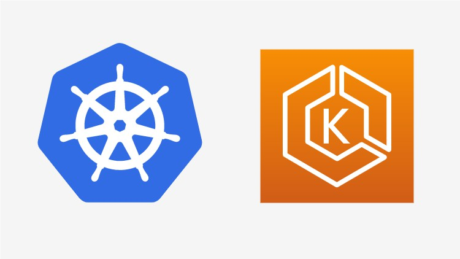

!SLIDE center transition=scrollUp

# EKS (Criando um cluster gerenciado)

!SLIDE commandline incremental transition=scrollUp

# Preparação da IDE

Acesse uma IDE com o Cloud9, caso não possua o repositório local faça o clone:

	$ test -d ~/environment/kube-class/ || \
		git clone https://github.com/fiapdevops/kube-class \
		~/environment/kube-class && \
		git -C ~/environment/kube-class pull \
		https://github.com/fiapdevops/kube-class -f

Execute o script de configuração do ambiente:

	$ chmod +x ~/environment/kube-class/cloud9/scripts/*
	$ bash -x  ~/environment/kube-class/cloud9/scripts/config.sh

.callout.info `O script acima, executará a expansão do disco da IDE, instalação dos binários kubectl, eksctl e helm adição das variáveis de bash_complation e autorização para o security group entre ide e eks`

!SLIDE commandline incremental transition=scrollUp

# Preparação da IDE

Utilize o eksctl para validar o cluster criado via interface:

	$ eksctl version

	$ eksctl get cluster eksworkshop
	NAME            VERSION STATUS  ...
	eksworkshop     1.23    ACTIVE  ...

Verifique o nodegroup com os nós que serão responsáveis pelo workload:

	$ eksctl get nodegroup --cluster eksworkshop
	CLUSTER         NODEGROUP       STATUS ...
	eksworkshop     eks-node-group  ACTIVE ...

.callout.question `É possível criar o cluster via eksctl? Sim o eksctl atua como solução de automação para entrega de cluster usando o conceito de infraestreutura imutável`

!SLIDE commandline incremental transition=scrollUp

# Preparação da IDE

Em seguida atualize a configuração da ide usando a cli da AWS:

	$ aws eks --region us-east-1 \
		update-kubeconfig \
		--name eksworkshop

Verifique a configuação populada no arquivo ~/.kube/config:

	$ kubectl version
	$ kubectl config view

.callout.info `Utilizaremos a versão 1.23 do kubernetes para parear com a versão utilizada em algumas etapas do workshop, é interessante usar sempre a mesma versão entre client (kubectl) e cluster (control-plane)'`

!SLIDE transition=scrollUp

# Preparação da IDE

Para que seja possível executar comandos com autorização no cluster utilizaremos a credencial local do larner labs, a mesma que foi usada na criação do cluster via interface;

1. Para executar essa mudança na ide no canto superior direito clique sobre o icone de engrenagem;

2. Escolha no menu aberto ao lado esquerdo a opção "AWS Settings";

3. Na seção "Credentials" desabilite o botão "AWS managed temporary credentials"

.callout.info `Essa alteração fará com que a IDE respeite a credencial que criaremos a seguir baseada no learner labs`

!SLIDE commandline incremental transition=scrollUp

# Preparação da IDE

Para configurar a nova credencial crie o arquivo abaixo:

	$ touch ~/.aws/credentials

Abra o arquivo usando o editor de sua preferência e coloque as permissões obitidas na tela inicial do learner labs clicando na opção **"AWS Details"** e em seguida no botão AWS CLI: **Show**

.callout.question `Cajo ocorra dúvida no processo verifique a etapa3 da configuração postada como vídeo no portal na sessão de material de apoio`

!SLIDE commandline incremental transition=scrollUp

# Preparação da IDE

Faça um teste acessando o cluster:

	$ kubectl get po -n kube-system
	NAME                     READY   STATUS    RESTARTS   AGE
	aws-node-8ld2g           1/1     Running   0          28m
	aws-node-8nx45           1/1     Running   0          28m
	aws-node-hpr7d           1/1     Running   0          28m
	coredns-d5b9bfc4-jrrtq   1/1     Running   0          10h
	...

Verifique a composição de nodes do cluster:

	$ kubectl get no
	NAME                            STATUS   ROLES    AGE   VERSION
	ip-172-31-15-208.ec2.internal   Ready    <none>   32m   v1.23...
	ip-172-31-27-95.ec2.internal    Ready    <none>   32m   v1.23...
	ip-172-31-83-108.ec2.internal   Ready    <none>   32m   v1.23...