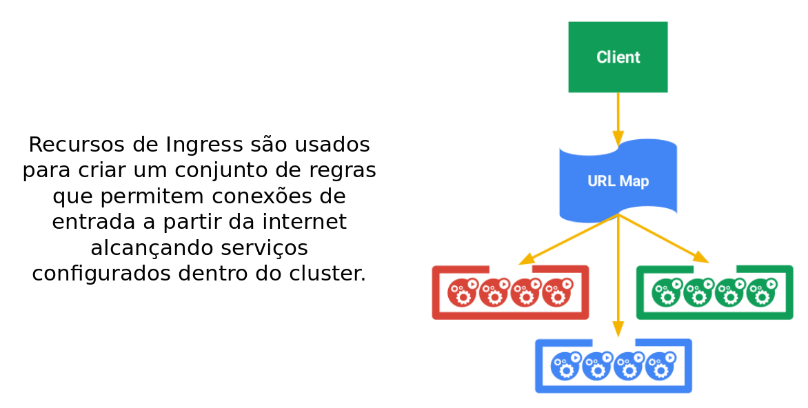
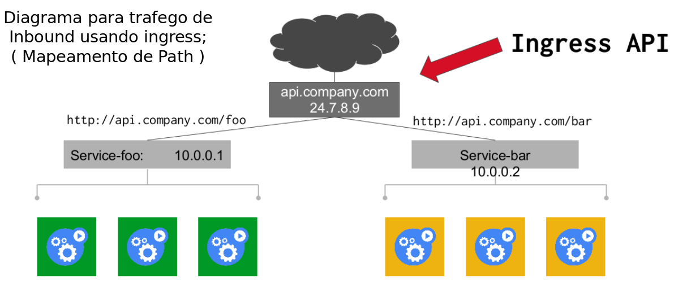

!SLIDE center transition=scrollUp

# Ingress

!SLIDE transition=scrollUp

# Ingress

!SLIDE transition=scrollUp

# Ingress

- Serviços e pods possuem endereços IP roteáveis dentro da rede de cluster e da infra-estrutura UOL, para publicar aplicações e serviços dentro dessa infra-estrutura usando o kubernetes o Resource Service é utilizado;

- Para publicar serviços que demandem acesso a partir da internet utilizamos o [Ingress](https://kubernetes.io/docs/concepts/services-networking/ingress/);

!SLIDE transition=scrollUp

# Ingress

Caracteristicas importantes sobre o Ingress:

- O Ingress trabalha no mapeamento de conexões oriundas da internet para os protocolos HTTP/HTTPS;
- Usando o ingress é possível mapear o tráfego de entrada para serviços específicos dentro do cluster;
- Esse mapeamento pode ser feito com base em:
	- HTTP host headers;
	- HTTP URL paths;

Trata-se de uma implementação do NGINX como Proxy reverso configurado através de resources do Kubernetes;

!SLIDE transition=scrollUp

# Ingress

