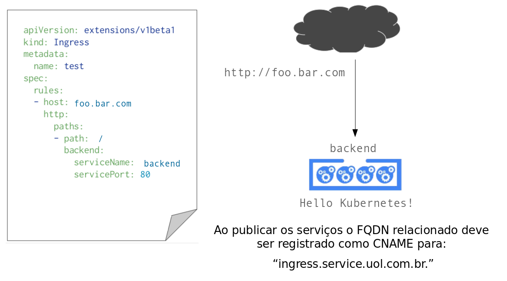
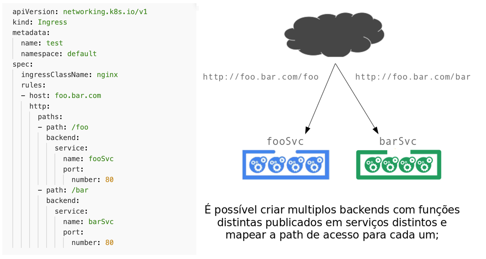

!SLIDE transition=scrollUp

# Ingress

Para publicar uma aplicação utilizando o ingress criamos uma estrutura similar ao exemplo abaixo:

    @@@shell
    apiVersion: extensions/v1beta1
    kind: Ingress
    metadata:
      name: test
    spec:
      rules:
      - host: foo.bar.com
        http:
          paths:
          - path: /
            hello:
              serviceName: hello
              servicePort: 80

.download ingress.yaml

!SLIDE transition=scrollUp

# Ingress

!SLIDE transition=scrollUp

# Ingress

