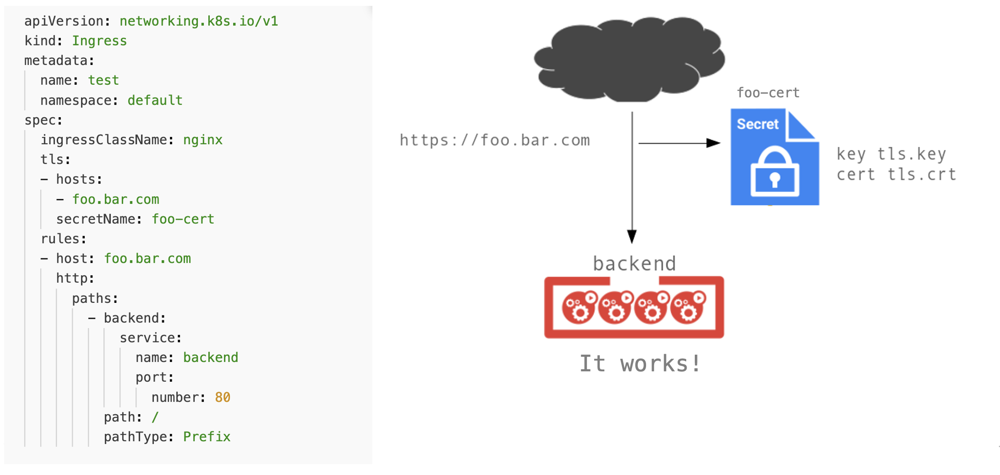

!SLIDE transition=scrollUp

# TLS no Ingress

- O Ingress também possui suporte a configuração de certificados usando recursos do Kubernetes;

- Esse modelo abstrai o processo de configuração de Ciphers e atualização de versões do Openssl;

.callout.conversation `O ingress seŕa responsável apenas por configurar o certificado, já o processo de solicitação continua o mesmo, usando o fluxo que passa por SecAdm, tendo o certificado e a CA em mãos essas informações serão usadas na criação do secret que será aplicado no ingress conforme modelo a seguir`

!SLIDE transition=scrollUp

# Implementando o Ingress

Criaremos uma estrutura de ingress com certificado e acesso utilizando protocolos HTTP e HTTPS;

Com relação a criação do certificado seguiremos da seguinte forma:

1. Criação de um certificado auto-assinado usando o OpenSSL;

2. Criação de um [secret](https://kubernetes.io/docs/concepts/configuration/secret/) para armazenar os dados desse certificado;

!SLIDE commandline incremental transition=scrollUp

# Implementando o Ingress

Para execução do teste primeiro crie um certificado auto-assinado:
	
	$ openssl req -x509 -nodes -days 365 -newkey rsa:2048 \
	-keyout ~/tls.key -out ~/tls.crt -subj "/CN=foo.bar.com"

Em seguida armazene as informações sobre este certificado em um secret:

	$ kubectl create secret tls foo-cert \
	--key ~/tls.key --cert ~/tls.crt
	secret "foo-cert" created

!SLIDE transition=scrollUp

# Implementando o Ingress

Crie o arquivo de configuração do Ingress utilizando o modelo [ingress-tls.yaml](URL)

    @@@shell
    apiVersion: extensions/v1beta1
    kind: Ingress
    metadata:
      name: test
    spec:
      tls:
      - hosts:
        - foo.bar.com
        secretName: foo-cert
      rules:
      - host: foo.bar.com
        http:
          paths:
          - path: /
            hello:
              serviceName: hello
              servicePort: 80

.download ingress-tls.yaml

!SLIDE commandline incremental transition=scrollUp

# Implementando o Ingress

Aplique a configração do ingress:

	$ kubectl apply -f ingress-tls.yaml
	ingress "test" configured

	$ kubectl get ing
	NAME      HOSTS         ADDRESS   PORTS     AGE
	test      foo.bar.com             80, 443   1m

	$ curl https://10.147.X.X -H 'Host:foo.bar.com' -k
	Hello Kubernetes!

.callout.info `No sandbox o acesso de egresso é bloqueado mas é possível testar a exata configuração a ser aplicada em produção usando o endereço interno dos nós de ingress, consulte este endereço com o instrutor e mapeie para o FQND apontado em sua configuração para testes`

!SLIDE transition=scrollUp

# TLS no Ingress

!SLIDE transition=scrollUp

# Implementando o Ingress

**Bundle Certificates:**

- Por padrão o nginx não possui campo para especificação da CA utilizada na assinatura do certificado, logo alguns navegadores podem reclamar sobre um certificado assinado por uma certificadora não conhecida por ele (Mesmo que seja uma CA "válida");

- Para evitar esse problema proceder da mesma forma que no processo de configuração do certificado diretamente no Nginx: Utilizar um ***Certificado Bundle***;

- Não se esqueça de que o certificado de servidor deve aparecer antes das CAs no arquivo combinado, duvidas consultar o modelo descrito na [Documentação do Nginx](http://nginx.org/en/docs/http/configuring_https_servers.html#chains);
