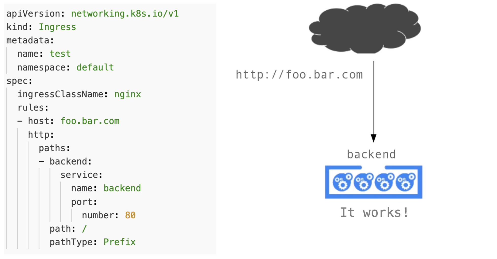

!SLIDE transition=scrollUp

# Ingress

Para publicar uma aplicação utilizando o ingress criamos uma estrutura similar ao exemplo abaixo:

    @@@shell
    apiVersion: networking.k8s.io/v1
    kind: Ingress
    metadata:
      name: test
      namespace: default
    spec:
      ingressClassName: nginx
      rules:
      - host: foo.bar.com
        http:
          paths:
            - backend:
              service:
                name: backend
                port:
                  number: 80
            path: /
            pathType: Prefix

.download ing-demo.yaml

!SLIDE transition=scrollUp

# Ingress

!SLIDE transition=scrollUp

# Ingress

