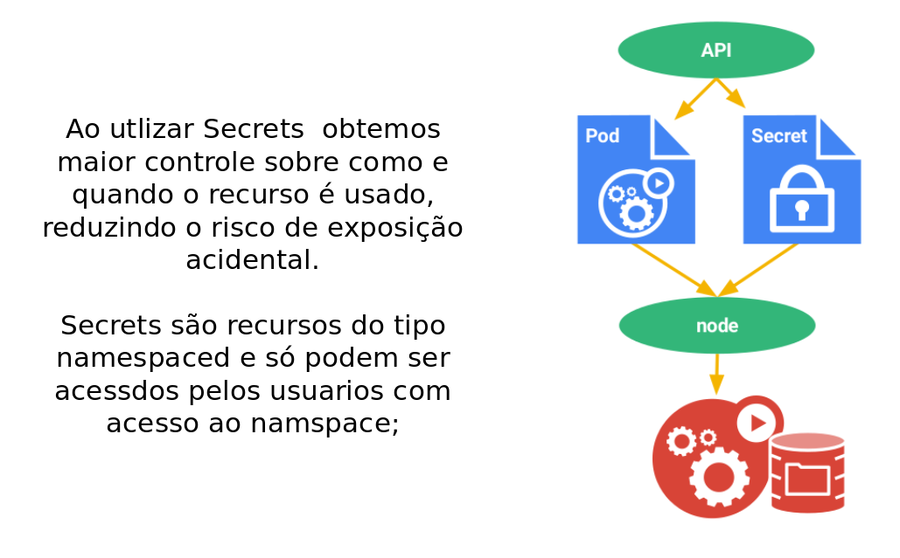

!SLIDE transition=scrollUp

# Secrets

- Objetos do tipo [Secret](https://kubernetes.io/docs/concepts/configuration/secret/) foram criados para permitir o armazenamento de informações sensíveis dentro do cluster, como por exemplos senhas, tokens de acesso OAUTH ou chaves seguras.  

- A ideia é evitar que informações deste tipo sejam inclusas diretamente na Pod ou na imagem do container, na implementação do Ingress utilizamos um secret para armazenar o certificado e a chave de criptogradia;

!SLIDE transition=scrollUp

# Secrets

