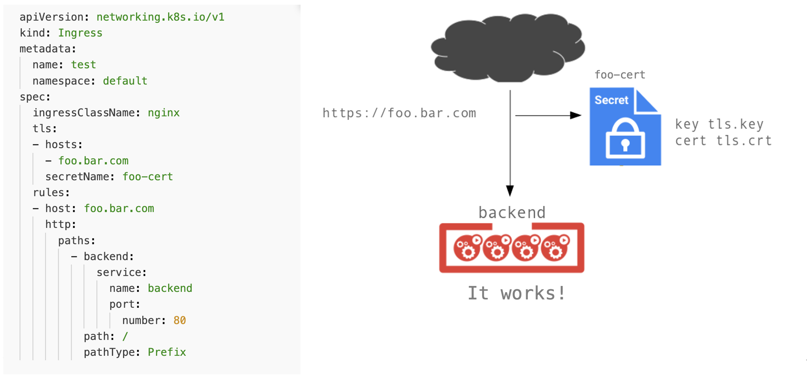

!SLIDE transition=scrollUp

# TLS no Ingress

- O Ingress também possui suporte a configuração de certificados usando recursos do Kubernetes;

- Esse modelo abstrai o processo de configuração de Ciphers e atualização de versões do Openssl;

- Criaremos uma estrutura de ingress com certificado e acesso utilizando protocolos HTTP e HTTPS;

Com relação a criação do certificado seguiremos da seguinte forma:

1. Criação de um certificado auto-assinado usando o OpenSSL;

2. Criação de um [secret](https://kubernetes.io/docs/concepts/configuration/secret/) para armazenar os dados desse certificado;

!SLIDE commandline incremental transition=scrollUp

# Implementando o Ingress

Para execução do teste primeiro crie um certificado auto-assinado:
	
	$ openssl req -x509 -nodes -days 365 -newkey rsa:2048 \
	-keyout ~/tls.key -out ~/tls.crt -subj "/CN=foo.bar.com"

Em seguida armazene as informações este certificado em um secret:

	$ kubectl create secret tls foo-cert \
    --key ~/tls.key --cert ~/tls.crt
	secret "foo-cert" created

!SLIDE commandline incremental transition=scrollUp

# Implementando o Ingress

Aplique a configração do ingress:

    $ cd ~/environment/kube-class/workshop/_files/share/

	  $ kubectl apply -f ingress-demo-tls.yaml
	  ingress "test" configured

    $ kubectl get ing
    NAME   CLASS   HOSTS         ...  PORTS     AGE
    test   nginx   foo.bar.com   ...  80, 443   34m

    $ curl -H 'Host: foo.bar.com' https://$INGRESS -k
    <html><body><h1>It works!</h1></body></html>

!SLIDE transition=scrollUp

# Implementando o Ingress

Aplicamos uma mudança de configuração do Ingress utilizando o modelo abaixo:

    @@@shell
    apiVersion: networking.k8s.io/v1
    kind: Ingress
    metadata:
      name: test
      namespace: default
    spec:
      ingressClassName: nginx
      tls:
      - hosts:
        - foo.bar.com
        secretName: foo-cert
      rules:
      - host: foo.bar.com
        http:
          paths:
            - backend:
                service:
                  name: backend
                  port:
                    number: 80
              path: /
              pathType: Prefix

.download ing-demo-tls.yaml

!SLIDE transition=scrollUp

# TLS no Ingress

