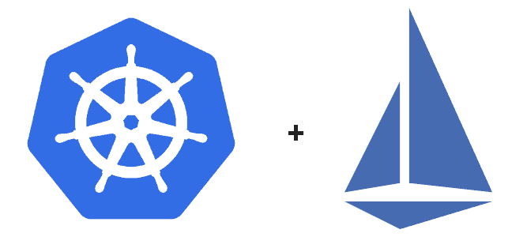

!SLIDE center transition=scrollUp

# Service Mesh com Istio

!SLIDE transition=scrollUp

# Service Mesh com Istio

O Istio é um **Service Mesh** de código-fonte aberto que se encaixa de forma transparente em aplicações entregues em arquitetura Kubernetes.

Sua arquitetura é dividida logicamente em dois componentes: data plane e control plane

- O **data plane** é composto por um conjunto de proxies (Envoy) implantados como sidecars, eles  medeiam e controlam toda a comunicação de rede entre os microsserviços. Eles também coletam a telemetria em todo o tráfego de malha.

- O **control plane** faz a gestão dos proxies e das regras de trafegados que serão criadas usando um resource chamado [Virtual Service](https://istio.io/latest/docs/reference/config/networking/virtual-service/);

!SLIDE transition=scrollUp

# Service Mesh com Istio

!SLIDE transition=scrollUp

# Arquitetura do Istio 

- O Istio funciona com um pequeno proxy de rede ao lado de cada microsserviço o que chamamos de **sidecar** implantando usando o [Envoy Proxy](https://istio.io/latest/docs/ops/deployment/architecture/#envoy);

[https://www.envoyproxy.io/](https://www.envoyproxy.io/);

!SLIDE transition=scrollUp

# Service Mesh com Istio

- Além do componente de proxy em sua versão recente o istio centralizou os recursos de gestão do cluster em um único componente chamado [Istiod](https://istio.io/latest/docs/ops/deployment/architecture/#istiod)

- Esse componente é o cérebro do control plane e fornece service discovery, configuração e gerenciamento de certificados além de ser o responsável por aplicar as regras definidas nos resources tipo virtual service em configurações do Envoy.

!SLIDE transition=scrollUp

# Service Mesh com Istio

- Esse formato permite que um único control plane opere na gestão de clusters distribuídos o que pode ser um aliado forte na construção de arquitetura multi cluster ou multi cloud com controle sobre a comunicação e tráfego lateral.

