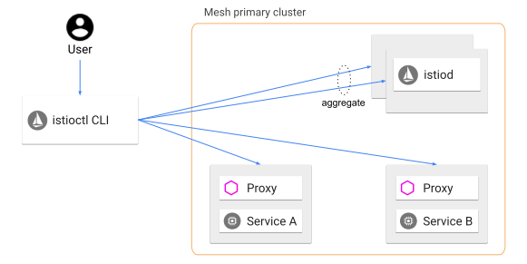

!SLIDE commandline incremental transition=scrollUp

# Instalação do Istio

Em nosso laboratório faremos a implantação do Istio sobre o cluster EKS do workshop;

A partir da IDE crie uma variável com a versão a ser entregue:

	$ echo 'export ISTIO_VERSION="1.14.1"' >> ${HOME}/.bash_profile
    $ source ${HOME}/.bash_profile

Faça o Download do código de implantação do Istio:

    $ cd ~/environment
    $ curl -L https://istio.io/downloadIstio | \
        ISTIO_VERSION=${ISTIO_VERSION} sh -

.callout.info `O conteúdo baixado contém os YAML files de instalação, um exemplo que aplicaremos em nosso workshop (diretório samples) e o binário de gestão do Istio o istioctl`

!SLIDE commandline incremental transition=scrollUp

# Instalação do Istio

Copie o cliente do Istioctl para a pasta de binários locais:

	$ cd ${HOME}/environment/istio-${ISTIO_VERSION}
    $ sudo cp -v bin/istioctl /usr/local/bin/
    $ istioctl version --remote=false

O Istioctl atuará como instalador para configurar os recursos de control plane e data plane em nosso cluster Kubernetes

!SLIDE commandline incremental transition=scrollUp

# Instalação do Istio

Execute o binário para instalar o Istio no namespace istio-system:

    $ yes | istioctl install --set profile=demo
    ✔ Istio core installed
    ✔ Istiod installed
    ✔ Egress gateways installed
    ✔ Ingress gateways installed
    ✔ Installation complete

.callout.question `Qual a configuração aplicada? Neste caso um setup simples usando o Istio dentro do cluster com todos os componentes baseados no perfil de configuração de demo.`

!SLIDE commandline incremental transition=scrollUp

# Criando um recurso para exposição via Ingress

Após a instalação verifique se os serviços foram criados, incluindo um serviço de [gateway](https://istio.io/latest/docs/concepts/traffic-management/#gateways) para comunicações externas ao cluster:

    $ kubectl -n istio-system get svc
    NAME                   TYPE           CLUSTER-IP    ...
    istio-egressgateway    ClusterIP      10.100.73.218 ...
    istio-ingressgateway   LoadBalancer   10.100.255.7  ...
    istiod                 ClusterIP      10.100.91.131 ...

Verifique o estado das pods do Istio:

    $ kubectl -n istio-system get pods
    NAME                                    READY   STATUS  ...
    istio-egressgateway-7fcb98978c-s7kmq    1/1     Running ...
    istio-ingressgateway-55b6cffcbc-zxv27   1/1     Running ...
    ...

