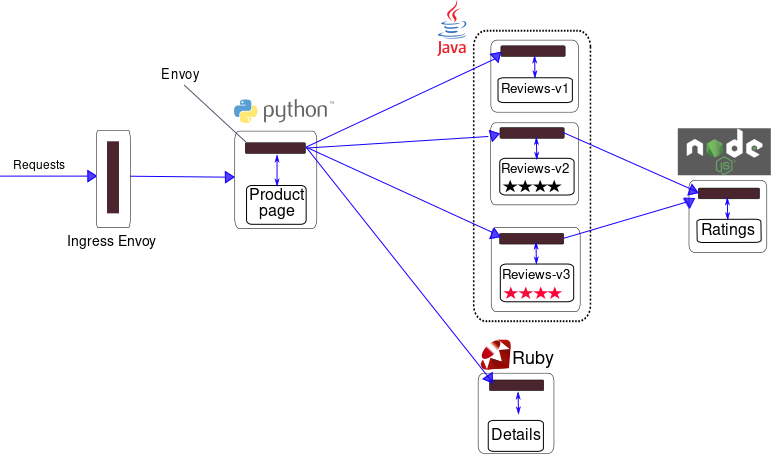

!SLIDE transition=scrollUp

# Testando o funcionamento do Istio

Para aproveitar os recursos do Istio, deve-se executar um proxy sidecar com envoy, mas nem todos os namespace e projetos precisam deste sidecar, exceto se fizer uso da malha de service mesh.

Por isso existem [duas formas](https://istio.io/latest/docs/setup/additional-setup/sidecar-injection/) de indicar quais namespaces usaram o Istio e com isso injetar a pod de sidecar nos recursos que serão entregues.

- Uma das formas é utilizando o istioctl com configuração manual;

- A outra é utilizando uma função de injeção automática que se baseia em uma label usada no namespace

!SLIDE commandline incremental transition=scrollUp

# Testando o funcionamento do Istio

Criaremos um namespace para a nossa aplicação de teste:

	$ kubectl create namespace bookinfo
    namespace/bookinfo created

Usaremos o segundo método ajustando uma label que fará o control plane injetar os proxies no namespace:

    $ kubectl label namespace bookinfo istio-injection=enabled
    namespace/bookinfo labeled

    $ kubectl get ns bookinfo --show-labels

!SLIDE transition=scrollUp

# Testando o funcionamento do Istio

Em nosso cenário utilizaremos a aplicação de amostra Bookinfo cuja [documentação pode ser consultada aqui](https://istio.io/latest/docs/examples/bookinfo/), trata-se de um exemplo de micro serviços com dependências e mais de uma versão do código, o que ajudará a explorar as funções de roteamento do Istio.

!SLIDE transition=scrollUp

# Testando o funcionamento do Istio

Um detalhe importante sobre essa aplicação que ajudará no entendimento dos próximos passos:

O aplicativo é dividido em quatro microsserviços separados:

- **productpage:** O microsserviço que chama os microsserviços de detalhes e revisões para preencher a página;
- **details:** O microsserviço de detalhes que contém informações do livro;
- **reviews:** O microsserviço que contém resenhas de livros;
- **ranking:** O microsserviço de avaliações que contém informações de classificação;

!SLIDE transition=scrollUp

# Testando o funcionamento do Istio

O microservi **reviews** possui **três versões:**

- A versão v1 não chama o serviço de classificação.
- A versão v2 chama o serviço de classificação e exibe cada classificação como **1 a 5 estrelas pretas.**
- A versão v3 chama o serviço de classificação e exibe cada classificação como **1 a 5 estrelas vermelhas.**

.callout.info `Utilizaremos as funções do Istio para simular o chaveamento entre essas versões e um modelo de circuit braker simulando um comportamento após a falha em um dos microserviços;`