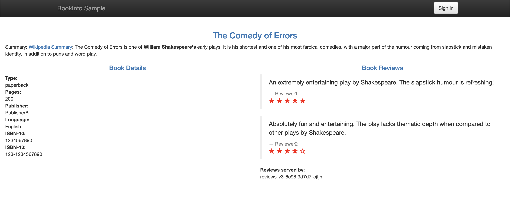

!SLIDE commandline incremental transition=scrollUp

# Deploy da App Boookinfo

Faça o dpeloyment da aplicação:

    $ cd ${HOME}/environment/istio-${ISTIO_VERSION}/
    $ kubectl -n bookinfo apply \
        -f samples/bookinfo/platform/kube/bookinfo.yaml

Verifique o estado dos recursos após a entrega:

    $ kubectl -n bookinfo get pod
    NAME                              READY   STATUS  ...
    details-v1-7f4669bdd9-98ngw       2/2     Running ... 
    productpage-v1-5586c4d4ff-4dw7f   2/2     Running ...
    ratings-v1-6cf6bc7c85-nsd4n       2/2     Running ...
    reviews-v1-7598cc9867-rmpck       2/2     Running ...
    reviews-v2-6bdd859457-xpmr9       2/2     Running ...

.callout.info `Verifique no output que foram entregues pods com as três diferentes versões do microserviço reviews;`

!SLIDE commandline incremental transition=scrollUp

# Deploy da App Boookinfo

Verifique o status dos serviços criados com a app:

    $ kubectl -n bookinfo get svc
    NAME          TYPE        CLUSTER-IP      EXTERNAL-IP   PORT(S) ...
    details       ClusterIP   10.100.98.195   <none>        9080/TCP
    productpage   ClusterIP   10.100.47.112   <none>        9080/TCP
    ratings       ClusterIP   10.100.99.62    <none>        9080/TCP
    reviews       ClusterIP   10.100.218.86   <none>        9080/TCP    

.callout.info `Todos os services foram entregues como ClusterIP, ou seja, apenas para acesso dentro do cluster, pois, diferente das entregas anteriores neste caso o acesso externo será centralizado em um ingress gateway`

!SLIDE commandline incremental transition=scrollUp

# Deploy da App Boookinfo

Com a aplicação rodando, precisaremos configurar acesso de fora do cluster, usando um [Istio Gateway](https://istio.io/latest/docs/reference/config/networking/gateway/) para essa finalidade:

	$ cd ${HOME}/environment/istio-${ISTIO_VERSION}
    $ kubectl -n bookinfo apply \
        -f samples/bookinfo/networking/bookinfo-gateway.yaml
    gateway.networking.istio.io/bookinfo-gateway created
    virtualservice.networking.istio.io/bookinfo created

Obtenha o endereço do loadBalancer público associado ao Istio Gateway:

    $ export GATEWAY_URL=$(kubectl -n istio-system \
        get svc istio-ingressgateway \
        -o jsonpath='{.status.loadBalancer.ingress[0].hostname}')

!SLIDE commandline incremental transition=scrollUp

# Deploy da App Boookinfo

Verifque o endereço e access via navegador:

    $ echo "http://${GATEWAY_URL}/productpage"

.callout.info `Neste caso o acesso usa a path /productpage, regras de roteamento são aplicadas para direcionar o tráfego quando temos multiplas aplicações expostas no mesmo cluster usando um recurso único de loadBalancer com a função de Ingress`

Copie a URL gerada no output e abra a aplicação em uma nova guia;

!SLIDE transition=scrollUp

# Deploy da App Boookinfo

A página deverá apresentar o conteúdo a abaixo:

.callount.warning `Recarregue a página várias vezes para ver como o layout e o conteúdo das avaliações mudam à medida que diferentes versões (v1, v2, v3) são chamadas.`

!SLIDE commandline incremental transition=scrollUp

# Criando as rotas no Istio

Criaremos uma regra de [roteamento de destino, um recurso do tipo DestinationRule](https://istio.io/latest/docs/reference/config/networking/destination-rule/) para controlar qual versão da aplicação será exibida:

    $ kubectl -n bookinfo apply \
        -f samples/bookinfo/networking/destination-rule-all.yaml

Verifique o estado das destination rules do Istio:

    $ kubectl -n bookinfo get destinationrules
    NAME          HOST          AGE
    details       details       17s
    productpage   productpage   17s
    ratings       ratings       17s
    reviews       reviews       17s

Inspecione uma das destination rules:

    $ kubectl -n bookinfo get destinationrules reviews -o yaml

!SLIDE transition=scrollUp

# Criando as rotas no Istio

Inspecione uma das destination rules:

    @@@shell
    apiVersion: networking.istio.io/v1beta1
    kind: DestinationRule
    metadata:
      name: reviews
      namespace: bookinfo
    spec:
      host: reviews
      subsets:
      - labels:
          version: v1
        name: v1
      - labels:
          version: v2
        name: v2
      ...

.callout.info `A DestinationRule especifica os Subsets, conjuntos de características (labels) que determin quais pods representam uma versão da App Bookinfo, por exemplo, as pods com a label v2 serão chamadas quando roteamos o tráfego para a versão 2 da aplicação`

!SLIDE commandline incremental transition=scrollUp

# Cenário 1: Criando rotas para uma única versão do microserviço

Para rotear o tráfego apenas para uma versão, aplicamos serviços virtuais, **Virtual Services** definem a versão padrão para os microsserviços entregues:

Crie uma regra onde todo o tráfego será encaminhado para reviews:v1 do microsserviço:

    $ kubectl -n bookinfo apply \
        -f samples/bookinfo/networking/virtual-service-all-v1.yaml
    virtualservice.networking.istio.io/productpage created
    virtualservice.networking.istio.io/reviews created
    ...

A regra que criamos indica que o tráfego de entrada deve respeitar a instrução de roteamento dos virtual services, verifique o virtual service reviews:

    $ kubectl get virtualservice -n bookinfo  reviews -o yaml

!SLIDE transition=scrollUp

# Cenário 1: Criando rotas para uma única versão do microserviço

Inspecione um dos resources tipo VirtualService:

    @@@shell
    apiVersion: networking.istio.io/v1beta1
    kind: VirtualService
    metadata:
      name: reviews
      namespace: bookinfo
    spec:
      hosts:
      - reviews
      http:
      - route:
        - destination:
            host: reviews
            subset: v1

.callout.warning `Teste a aplicação da regra  atualizando a página da app bookinfo, você verá sempre a v1 do microserviço, ou seja, a versão que não apresenta as estrelas, pois não usa o microserviço de reviews`

!SLIDE commandline incremental transition=scrollUp

# Cenário 2: Criando rotas com base em um header HTTP

Para o segundo exemplo criaremos uma regra avançada, essa regra utilizará um cabeçalho gerado na chamada HTTP para determinar qual versão (subset) da app será usada:

    $ cd ${HOME}/environment/istio-${ISTIO_VERSION}/samples/bookinfo
    $ kubectl -n bookinfo apply -f \
        networking/virtual-service-reviews-test-v2.yaml

Inspecione novamente o resource tipo VirtualService:

    $ kubectl -n bookinfo get virtualservices reviews -o yaml

.callout.warning `Para validar a regra na interface a App faça login com o usuário **jason**, deixe o campo da senha em branco e você verá apenas a v2 (com estrelas em preto)`;

!SLIDE transition=scrollUp

# Cenário 2: Criando rotas com base em um header HTTP

Inspecione novamente o resource tipo VirtualService:

    @@@shell
    spec:
      hosts:
      - reviews
      http:
      - match:
        - headers:
            end-user:
              exact: jason
        route:
        - destination:
            host: reviews
            subset: v2
      - route:
        - destination:
            host: reviews
            subset: v1

!SLIDE commandline incremental transition=scrollUp

# Cenário 3: Criando rotas para chavear o tráfego entre versões

Em nosso último teste criaremos uma rota onde 50% do tráfego será direcionado a uma versão e 50% a outra versão;

Para criar este cenário primeiro configure novamente todo o roteamento para a versão v1:

    $ kubectl -n bookinfo apply -f \
        networking/virtual-service-all-v1.yaml

Em seguida aplique a configuração que comporta os dois serviços:

    $ kubectl -n bookinfo apply -f \
        networking/virtual-service-reviews-50-v3.yaml

    $ kubectl -n bookinfo get virtualservices reviews -o yaml

!SLIDE transition=scrollUp

# Cenário 3: Criando rotas para chavear o tráfego entre versões

Inspecione novamente o resource tipo VirtualService:

    @@@shell
    spec:
      hosts:
      - reviews
      http:
      - route:
        - destination:
            host: reviews
            subset: v1
          weight: 50
        - destination:
            host: reviews
            subset: v3
          weight: 50

.callout.warning `Para testar, atualize seu navegador várias vezes e você verá a aplicação respondendo na versão v1 (sem o recurso de rating) ou na versão v3 (com o recurso e estrelas em vermelho)`
