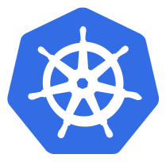

!SLIDE center transition=scrollUp

# Kubeadm

!SLIDE commandline incremental transition=scrollUp

# Kubeadm: Configurando as instâncias

Para iniciar a construção de nosso primeiro ambiente faça a implantação das instâncias:

	$ git clone https://github.com/fiapdevops/kube-class

	$ cd kube-class/kubeadm/terraform

	$ terraform init

	$ terraform apply -auto-approve

!SLIDE transition=scrollUp

# Kubeadm: Configurando as instâncias

Ajuste a configuração de SSH para evitar a confirmação no acesso remoto:

	cat <<EOF | tee $HOME/.ssh/config
	Host *
    	StrictHostKeyChecking no
		User ubuntu
	EOF

	chmod 400 ~/.ssh/config

Recupere a chave gerada via Terraform que foi armazenada como estado local:

	terraform output -raw private_key > $HOME/.ssh/id_rsa
	
	chmod 600 $HOME/.ssh/id_rsa

.callout.info `Para simplificar nossa construção criaremos a chave local via terraform e adicionaremos as instâncias, o arquivo da chave foi salvo como estado e recuperado do output`

!SLIDE transition=scrollUp

# Kubeadm: Configurando as instâncias

Aguarde até que a instância esteja criada, em seguida copie o seu endereço ip que será usado para acesso remoto:

	export CONTROLPLANE=$(
		aws ec2 describe-instances \
        	--filters "Name=tag:Name,Values=controlplane" \
        	--query "Reservations[*].Instances[*].PrivateIpAddress" \
			--output text)
		
	echo $CONTROLPLANE

 Faça o acesso via SSH:

	ssh $CONTROLPLANE

!SLIDE transition=scrollUp

# Kubeadm: Inicialização do cluster

Dentro da insância crie as variaveis que serão utilizadas com o kubeadm:

	export \
	IPADDR=$(curl http://169.254.169.254/latest/meta-data/local-ipv4)
	
	export NODENAME=$(hostname -s)
	export POD_CIDR="192.168.0.0/16"

Remova a configuração atual do containerd e em seguida reinicie po serviço:

	sudo rm -rf /etc/containerd/config.toml
	sudo systemctl restart containerd

!SLIDE transition=scrollUp

# Kubeadm: Inicialização do cluster

Inicie o kubeadm utilizando as variaveis criadas anteriormente:

	sudo kubeadm init --apiserver-advertise-address=$IPADDR \
        --apiserver-cert-extra-sans=$IPADDR  \
        --pod-network-cidr=$POD_CIDR \
        --node-name $NODENAME \
        --ignore-preflight-errors Swap

!SLIDE commandline incremental transition=scrollUp

# Kubeadm: Inicialização do cluster

Ajuste as variaveis de sua home de usuário conforme para acessar o cluster kubectl

	$ mkdir -p $HOME/.kube
	$ sudo cp -i /etc/kubernetes/admin.conf $HOME/.kube/config
	$ sudo chown $(id -u):$(id -g) $HOME/.kube/config

Valide o funcionamento do cluster executando uma consulta via kubectl:

	$ kubectl get po -n kube-system
	NAME                                      READY   STATUS    RESTARTS   AGE
	etcd-ip-172-31-7-180                      1/1     Running   0          12s
	kube-apiserver-ip-172-31-7-180            1/1     Running   0          12s
	kube-controller-manager-ip-172-31-7-180   1/1     Running   0          12s
	kube-scheduler-ip-172-31-7-180            1/1     Running   0          12s