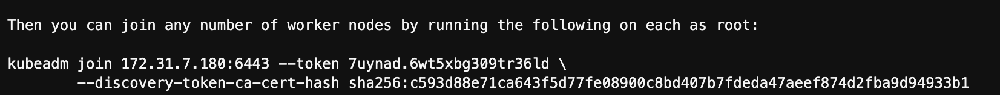

!SLIDE transition=scrollUp

# Kubeadm: Ingresso de novos nodes

Para executar o ingresso dos nodes remanecentes, é necessário um comando no kubeadm, conforme exemplo abaixo:

!SLIDE transition=scrollUp

# Kubeadm: Ingresso de novos nodes

Para facilitar esse processo **abra uma nova guia** e execute:

	export CONTROLPLANE=$(
    aws ec2 describe-instances \
        --filters "Name=tag:Name,Values=controlplane" \
        --query "Reservations[*].Instances[*].PrivateIpAddress" \
		--output text)
		
	JOIN_CMD=\
	$(ssh $CONTROLPLANE  sudo kubeadm token create --print-join-command)

	echo $JOIN_CMD

.callout.info `O comando anterior permite recuperar o token que será usado para os workers autenticaram no cluster, e identificar o endereço dos workers;`

!SLIDE transition=scrollUp

# Kubeadm: Ingresso de novos nodes

Com esse dado em mãos execute o join dos workers no cluster:

	export WORKERS=$(
    aws ec2 describe-instances \
        --filters "Name=tag:Name,Values=worker" \
        --query "Reservations[*].Instances[*].PrivateIpAddress" \
		--output text)

	for HOST in $(echo $WORKERS); do \
    	ssh $HOST \
    	"sudo rm -rf /etc/containerd/config.toml && \
		sudo systemctl restart containerd && \
		sudo $JOIN_CMD"; \
    done

!SLIDE commandline incremental transition=scrollUp

# Kubeadm: Ingresso de novos nodes

Acessando novamente a guia logada no controlplane verifique o status dos nodes adicionados:

	$ kubectl get nodes
	NAME              STATUS     ROLES           AGE   VERSION
	ip-172-31-13-43   NotReady   <none>          18s   v1.27.2
	ip-172-31-7-180   NotReady   control-plane   20m   v1.27.2
	ip-172-31-9-39    NotReady   <none>          14s   v1.27.2

.callout.warning `Os nodes estão a disposição porém sem um addon atuando como pod network e portanto em status NotReady`

!SLIDE commandline incremental transition=scrollUp

# Kubeadm: Adicionando o calico ao cluster:

Configure o calico como o nosso mecanismo de pod network:

	$ kubectl apply -f <URL>

[Copie a URL aqui](https://raw.githubusercontent.com/projectcalico/calico/v3.25.0/manifests/calico.yaml)

.callout.warning `Foi necessário encurtar a URL para a tela do workshop mas na prática estamos criando um resouce com base no repositório git`

!SLIDE commandline incremental transition=scrollUp

# Kubeadm: Ingresso de novos nodes

Aguarde até que as pods estejam em execução:

	$ kubectl get po -n kube-system
	calico-kube-controllers-6c99c8747f-rs7d8   0/1     Pending 
	calico-node-6nqn7                          0/1     Init:2/3
	calico-node-gtzsv                          0/1     Init:1/3
	calico-node-qmjsq                          0/1     Init:1/3
	...

Verifique novamente o status do cluster:

	$ kubectl get nodes
	ip-172-31-13-43   Ready    <none>          5m8s   v1.27.2
	ip-172-31-7-180   Ready    control-plane   25m    v1.27.2
	ip-172-31-9-39    Ready    <none>          5m4s   v1.27.2

!SLIDE commandline incremental transition=scrollUp

# Kubeadm: Testando o funcionamento do cluster

Crie um workload inicial para validar o funcionamento do cluster:

	$ kubectl -n default apply -f \
		https://k8s.io/examples/application/deployment.yaml

Verifique a criação das pods e distribuição:

	$ kubectl get po -n default -o wide
	nginx-deployment-cbdccf466-qg2v8   1/1     Running   0
	nginx-deployment-cbdccf466-ts4v6   1/1     Running   0