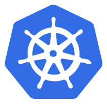

!SLIDE center transition=scrollUp

# Pods

!SLIDE commandline incremental transition=scrollUp

# Pods

- A pod é a menor unidade a ser criada dentro do Kubernetes para a entrega de um workload, Trata-se de um agrupamento lógico composto por um ou mais containers que pertencem a uma aplicação;

- As pods são criadas dentro do namespace, todos os containers dentro de uma pod compartilham  volumes, uma mesma interface de rede e configurações gerais aplicadas à pod;

!SLIDE commandline incremental transition=scrollUp

# Pods

!SLIDE commandline incremental transition=scrollUp

# Criando uma Pod

Crie a pod com nginx:

	$ kubectl run teste --image nginx:latest -n default
	pod/teste created
	
	$ kubectl get pods

!SLIDE commandline incremental transition=scrollUp

# Criando uma Pod

Explore detalhes sobre a pod criada executando um describe:

	$ kubectl describe pod teste -n default
	Name:             teste
	Namespace:        default
	Priority:         0
	Service Account:  default
	...

.callout.info `Cada pod alocada possui um endereço ip válido, ( Campo "IP:" ) se for necessário remover e recriar essa pod novamente este endereço IP provavelmente será alterado.`

!SLIDE commandline incremental transition=scrollUp

# Deletando uma Pod

É possível remover um Pod manualmente porém ela será recriada pelo deployment relacionado:

	$ kubectl delete po teste
	pod "teste" deleted

!SLIDE commandline incremental transition=scrollUp

# Estruturas de Yaml na construção de resources

Embora o exemplo tenha usado uma instrução direta é provável que na porática os recursos de pods sejam criados a partir de estruturas no formato yaml ou json como esta:

	$ kubectl apply -f https://k8s.io/examples/pods/simple-pod.yaml
	pod/nginx created

.callout.warning `Explore a pod recém crida e depois destrua o resource como no exemplo anterior`

.callout.info `Embora seja relevante engtender o formato e estrutura de uma pod na prátic a os workloads serão entregues organizando pods em estruturas de deployment, daemosets e statefulsets`
